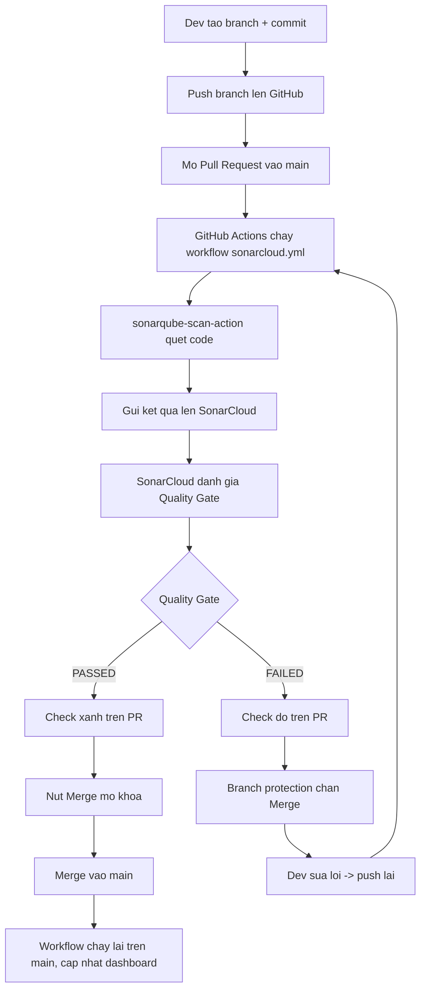
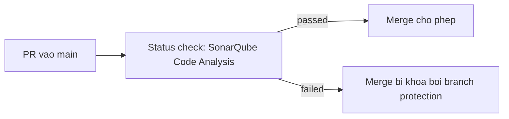

# Hướng dẫn SonarCloud + GitHub Actions: quét code và chặn merge khi có lỗi

Tài liệu mô tả trọn vẹn quy trình từ đầu đến cuối: khi dev mở Pull Request -> GitHub Actions
chạy quét SonarCloud -> nếu Quality Gate FAIL thì **chặn không cho merge** vào `main`.

Giá trị thực tế của project này:

- Organization key: `buihongkong`
- Project key: `BuiHongKong_SonarQube`
- Nhánh bảo vệ: `main`

---

## 1. Tổng quan luồng hoạt động



Điểm cốt lõi: **GitHub không tự biết kết quả Sonar**. Việc chặn merge do **Branch Protection Rule**
quyết định, dựa trên status check mà SonarCloud gắn lên PR (xem Phần 6).

---

## 2. Thành phần trong repo

| File | Vai trò |
|------|---------|
| `.github/workflows/sonarcloud.yml` | Định nghĩa CI: chạy quét trên `push main` và `pull_request` |
| `sonar-project.properties` | Khai báo `organization`, `projectKey`, `sources`... |
| `python/`, `javascript/` | Code demo chứa lỗi cố ý để Sonar phát hiện |

Nội dung `sonar-project.properties`:

```properties
sonar.organization=buihongkong
sonar.projectKey=BuiHongKong_SonarQube
sonar.projectName=SonarQube
sonar.sources=python,javascript
sonar.sourceEncoding=UTF-8
sonar.python.version=3.11
```

Nội dung workflow `.github/workflows/sonarcloud.yml`:

```yaml
name: SonarQube Cloud
on:
  push:
    branches:
      - main
  pull_request:
    types: [opened, synchronize, reopened]
jobs:
  sonarqube:
    name: Build and analyze
    runs-on: ubuntu-latest
    steps:
      - uses: actions/checkout@v4
        with:
          fetch-depth: 0
      - name: SonarQube Cloud Scan
        uses: SonarSource/sonarqube-scan-action@v7
        env:
          SONAR_TOKEN: ${{ secrets.SONAR_TOKEN }}
```

---

## 3. Setup ban đầu (làm 1 lần)

### 3.1. Kết nối SonarCloud với GitHub
1. Đăng nhập [sonarcloud.io](https://sonarcloud.io) bằng GitHub.
2. **+ -> Analyze new project** -> chọn organization `buihongkong` -> chọn repo.
3. Ghi lại organization key và project key (đã điền sẵn trong `sonar-project.properties`).

### 3.2. Tắt Automatic Analysis (vì dùng CI-based)
- Vào project -> **Administration -> Analysis Method** -> tắt **Automatic Analysis**.
- Nếu không tắt sẽ bị lỗi: "You are running CI analysis while Automatic Analysis is enabled".

### 3.3. Tạo token và lưu vào GitHub Secrets
1. SonarCloud: **My Account -> Security -> Generate Tokens** -> copy.
2. GitHub repo: **Settings -> Secrets and variables -> Actions -> New repository secret**
   - Name: `SONAR_TOKEN`
   - Value: dán token.
3. KHÔNG commit token vào repo. Workflow chỉ tham chiếu `${{ secrets.SONAR_TOKEN }}`.

### 3.4. Cài SonarCloud GitHub App (để có PR decoration + status check)
- Đảm bảo **SonarCloud GitHub App** đã được cài cho repo (thường cài lúc import project).
- Đây là thứ giúp SonarCloud gắn check "SonarQube Code Analysis" lên PR. Không có App thì
  status check sẽ không xuất hiện và không chặn merge được.
- Kiểm tra tại: GitHub -> **Settings -> GitHub Apps** (hoặc Integrations) -> SonarCloud -> Configure.

---

## 4. Quality Gate: thứ quyết định PASS/FAIL

- SonarCloud mặc định dùng Quality Gate **"Sonar way"**, áp lên **new code** (phần thay đổi trong PR).
- Các điều kiện điển hình của "Sonar way" trên new code:
  - 0 New Bugs, 0 New Vulnerabilities
  - Security Hotspots Reviewed = 100%
  - Coverage on new code >= 80% (chỉ áp khi có báo cáo coverage)
  - Duplicated Lines on new code < 3%
- Xem/sửa tại: SonarCloud -> **Organization -> Quality Gates**.

Với code demo (đầy SQLi, hardcoded secret, `eval`...), Quality Gate sẽ **FAILED** ngay.

> Lưu ý: project hiện chưa có unit test nên điều kiện coverage có thể làm gate fail vì
> "coverage 0%". Nếu chỉ muốn demo lỗi tĩnh, có thể tạo Quality Gate riêng bỏ điều kiện coverage,
> hoặc chấp nhận fail (đằng nào code demo cũng fail vì bug/vuln).

---

## 5. (QUAN TRỌNG) Chặn merge khi code lỗi — Branch Protection

Đây là bước biến "phát hiện lỗi" thành "không cho merge". Làm trên GitHub:

### 5.1. Chạy workflow ít nhất 1 lần trước
Mở 1 PR bất kỳ để workflow chạy, nhờ vậy GitHub mới "biết" tên status check
**"SonarQube Code Analysis"** và hiện nó ra trong danh sách chọn ở bước sau.

### 5.2. Tạo Branch Protection Rule
1. GitHub repo -> **Settings -> Branches -> Add branch protection rule** (hoặc **Rules -> Rulesets**).
2. **Branch name pattern**: `main`
3. Tích **Require a pull request before merging**
   - (Khuyến nghị) Require approvals: 1
4. Tích **Require status checks to pass before merging**
   - Tích thêm **Require branches to be up to date before merging**
   - Trong ô tìm kiếm checks, chọn: **SonarQube Code Analysis**
     (nếu dùng tên cũ có thể là "SonarCloud Code Analysis")
5. (Khuyến nghị) Tích **Do not allow bypassing the above settings** để admin cũng không lách được.
6. **Create / Save changes**.

### 5.3. Kết quả
- Từ giờ, mọi PR vào `main` phải có check **SonarQube Code Analysis = passed** mới được merge.
- Quality Gate FAIL -> check đỏ -> nút **Merge bị khóa**.



---

## 6. Vòng đời một PR (cách dev thao tác hằng ngày)

```bash
# 1. Tao branch
git checkout -b feature/xyz

# 2. Sua code, commit
git commit -am "feat: ..."

# 3. Push
git push -u origin feature/xyz

# 4. Mo Pull Request vao main (tren GitHub)
```

Sau khi mở PR:
1. Tab **Checks** của PR hiện job "Build and analyze" đang chạy (~1-2 phút).
2. SonarCloud comment summary + annotate lỗi lên từng dòng (tab **Files changed**).
3. Nếu **FAILED**: sửa lỗi theo gợi ý -> commit -> push lại -> workflow tự chạy lại.
4. Nếu **PASSED**: reviewer approve -> **Merge**.

---

## 7. Xem kết quả ở đâu

| Nơi | Xem được gì |
|-----|-------------|
| Pull Request (GitHub) | Comment summary + annotation đỏ từng dòng + status check |
| Dashboard SonarCloud | `https://sonarcloud.io/project/overview?id=BuiHongKong_SonarQube` — đầy đủ Issues, Security Hotspots, Measures |
| Tab Actions (GitHub) | Chỉ là log chạy scan (debug pipeline), cuối log có link tới dashboard |

Repo public -> dashboard ai cũng xem được, không cần đăng nhập.

---

## 8. Chia sẻ kết quả cho dev khác

- Cách tốt nhất: dev xem **annotation ngay trong PR** (đúng dòng code lỗi + cách sửa).
- Gửi link dashboard có filter: vào tab **Issues**, lọc theo loại/severity/assignee rồi copy URL.
- Bật thông báo: mỗi dev vào **My Account -> Notifications**; hoặc tích hợp Slack/Teams.
- Mời dev vào org (Organization -> Members) với quyền tối thiểu nếu cần thao tác issue.

---

## 9. Troubleshooting (các lỗi thường gặp)

| Lỗi | Nguyên nhân | Cách sửa |
|-----|-------------|----------|
| `Organization key '<...>' does not exist` | `sonar.organization` sai/để placeholder | Điền đúng org key (`buihongkong`) |
| `Project not found` / `projectKey` sai | `sonar.projectKey` không khớp | Lấy đúng key tại SonarCloud -> project -> Information |
| `You are running CI analysis while Automatic Analysis is enabled` | Bật cả 2 chế độ | Tắt Automatic Analysis (mục 3.2) |
| Lỗi 401 / authentication failed | Token sai/hết hạn | Tạo lại token, cập nhật secret `SONAR_TOKEN` |
| Check "SonarQube Code Analysis" không hiện trong branch protection | Chưa chạy workflow lần nào, hoặc chưa cài SonarCloud GitHub App | Mở 1 PR cho workflow chạy + cài App (mục 3.4) |
| PR từ fork không có token | GitHub chặn secret cho PR từ fork (repo public) | Bình thường; chỉ scan PR nội bộ, hoặc dùng cơ chế khác |

---

## 10. Security check

- **Nơi lưu token**: GitHub Secrets (`SONAR_TOKEN`). KHÔNG nằm trong code/repo.
- **Quyền token**: scope tối thiểu (project-level Analyze).
- **`sonar-project.properties`**: chỉ chứa org/projectKey (không nhạy cảm) -> commit an toàn.
- **Rotation/revocation**: nếu token lộ (vd lộ trong ảnh chụp màn hình), vào SonarCloud
  My Account -> Security -> Revoke, tạo token mới, cập nhật secret.
- **Đã commit secret thật vào git chưa?**: phải luôn là **No**.

---

## Checklist nhanh

- [ ] Kết nối repo với SonarCloud (org `buihongkong`)
- [ ] Tắt Automatic Analysis
- [ ] Tạo `SONAR_TOKEN` trong GitHub Secrets
- [ ] Cài SonarCloud GitHub App cho repo
- [ ] `sonar-project.properties` đúng org + projectKey
- [ ] Có `.github/workflows/sonarcloud.yml`
- [ ] Mở 1 PR cho workflow chạy lần đầu
- [ ] Tạo Branch Protection Rule cho `main` + chọn required check "SonarQube Code Analysis"
- [ ] Test: mở PR có lỗi -> xác nhận Merge bị khóa
